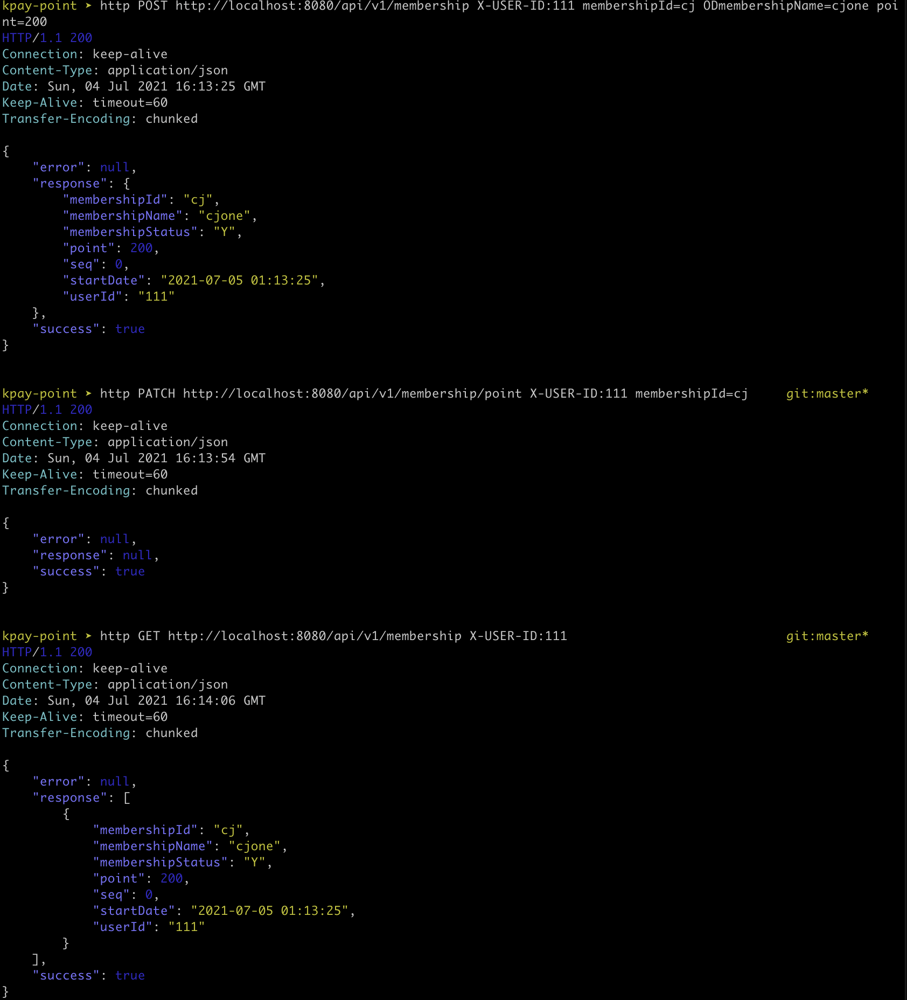
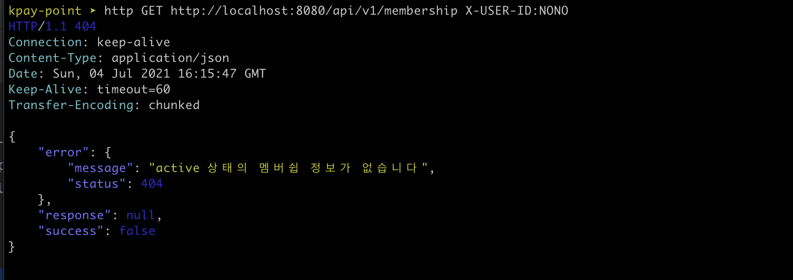
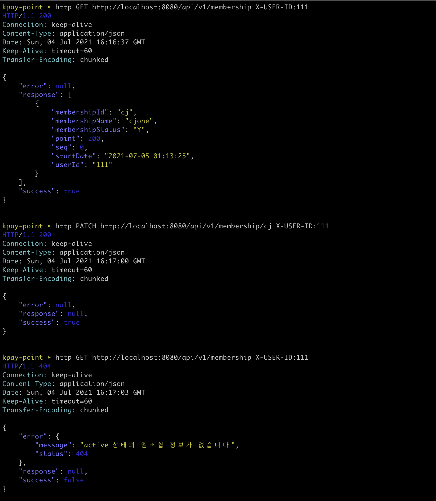

1. 멤버쉽 등록 , 1회 적립 및 조회
   ```
   http POST http://localhost:8080/api/v1/membership X-USER-ID:111 membershipId=cj ODmembershipName=cjone point=200
   http PATCH http://localhost:8080/api/v1/membership/point X-USER-ID:111 membershipId=cj
   http GET http://localhost:8080/api/v1/membership X-USER-ID:111
   ```
   
1. 멤버쉽 정보가 없는 회원 조회
   ```aidl
   http GET http://localhost:8080/api/v1/membership X-USER-ID:NONO
   ```
   
1. 멤버쉽 등록 후 DeActive 상태 설정, 그리고 다시 조회   
   
